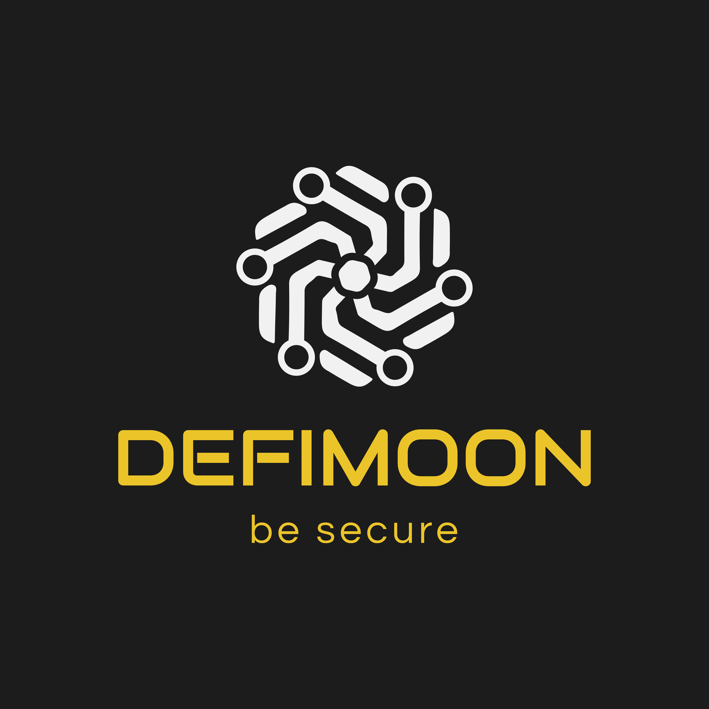

<p align="center">
  
</p>

<h1 align="center">Smart Contract Audit Report</h1>

<p align="center"><b>March, 2026</b></p>

<p align="center"><b>Chainlink Payment Abstraction V2</b></p>

---

**23 March 2026**

This audit report was prepared by Defimoon for Chainlink Payment Abstraction V2.

## Audit information

| Field | Details |
|-------|---------|
| Description | Permissionless Dutch auction system for fee-to-LINK conversions with CowSwap integration |
| Site | https://chain.link/ |
| Audited files | AuctionBidder.sol, BaseAuction.sol, Caller.sol, GPV2CompatibleAuction.sol, PriceManager.sol, WorkflowRouter.sol |
| Timeline | 18 March 2026 – 23 March 2026 |
| Audited by | Defimoon Security Team |
| Approved by | Kirill Minyaev |
| Languages | Solidity 0.8.26 |
| Methods | Architecture Review, Unit Testing, Functional Testing, Manual Review |
| Source code | https://github.com/code-423n4/2026-03-chainlink |
| Chain | Ethereum Mainnet |
| Status | Risks Identified |

### Findings Summary

| Severity | Count |
|----------|-------|
| 🔴 High Risk | 1 |
| 🟡 Medium Risk | 3 |
| 🟢 Low Risk | 4 |
| 🔵 Informational | 3 |

> **🔴 High Risk** — A fatal vulnerability that can cause the loss of all Tokens / Funds.
>
> **🟡 Medium Risk** — A vulnerability that can cause the loss of some Tokens / Funds.
>
> **🟢 Low Risk** — A vulnerability which can cause the loss of protocol functionality.
>
> **🔵 Informational** — Non-security issues such as functionality, style, and convention.

---

## Disclaimer

This audit is not financial, investment, or any other kind of advice and could be used for informational purposes only. This report is not a substitute for doing your own research and due diligence should always be paid in full to any project. Defimoon is not responsible or liable for any loss, damage, or otherwise caused by reliance on this report for any purpose. Defimoon has based this audit report solely on the information provided by the audited party and on facts that existed before or during the audit being conducted. Defimoon is not responsible for any outcome, including changes done to the contract/contracts after the audit was published. This audit is fully objective and only discerns what the contract is saying without adding any opinion to it. Defimoon has no connection to the project other than the conduction of this audit and has no obligations other than to publish an objective report. Defimoon will always publish its findings regardless of the outcome of the findings. The audit only covers the subject areas detailed in this report and unless specifically stated, nothing else has been audited. Defimoon assumes that the provided information and materials were not altered, suppressed, or misleading. This report is published by Defimoon, and Defimoon has sole ownership of this report. Use of this report for any reason other than for informational purposes on the subjects reviewed in this report including the use of any part of this report is prohibited without the express written consent of Defimoon. In instances where an auditor or team member has a personal connection with the audited project, that auditor or team member will be excluded from viewing or impacting any internal communication regarding the specific audit.

## Audit Information

Defimoon utilizes both manual and automated auditing approach to cover the most ground possible. We begin with generic static analysis automated tools to quickly assess the overall state of the contract. We then move to a comprehensive manual code analysis, which enables us to find security flaws that automated tools would miss. Finally, we conduct an extensive unit testing to make sure contract behaves as expected under stress conditions.

In our decision making process we rely on finding located via the manual code inspection and testing. If an automated tool raises a possible vulnerability, we always investigate it further manually to make a final verdict. All our tests are run in a special test environment which matches the "real world" situations and we utilize exact copies of the published or provided contracts.

While conducting the audit, the Defimoon security team uses best practices to ensure that the reviewed contracts are thoroughly examined against all angles of attack. This is done by evaluating the codebase and whether it gives rise to significant risks. During the audit, Defimoon assesses the risks and assigns a risk level to each section together with an explanatory comment.

---

## Audit overview

The Chainlink Payment Abstraction V2 system implements a permissionless Dutch auction mechanism for converting fee tokens to LINK. The system is well-architected with clear separation of concerns across six main contracts. The codebase follows Chainlink's established patterns with robust access control via OpenZeppelin's `AccessControlDefaultAdminRules`.

However, critical inconsistencies were identified between the two auction execution paths (direct `bid()` and CowSwap's `isValidSignature()`), as well as insufficient validation in the `performUpkeep` function that contradicts the contract's own interface specification. These issues directly affect the system's core auction curve invariant.

The system uses a comprehensive role-based access control model with timelock-protected admin operations, which mitigates several potential attack vectors but does not fully prevent issues arising from trusted role assumptions.

---

## Summary of findings

| ID | Description | Severity | Status |
|----|-------------|----------|--------|
| DFM-1 | CowSwap orders bypass `minBidUsdValue` validation | 🔴 High Risk | Open |
| DFM-2 | `performUpkeep` does not validate auction end conditions | 🟡 Medium Risk | Open |
| DFM-3 | `checkUpkeep` fails to end dust-balance auctions with stale prices | 🟡 Medium Risk | Open |
| DFM-4 | `AuctionBidder.auctionCallback` executes unrestricted arbitrary calls | 🟡 Medium Risk | Open |
| DFM-5 | Inconsistent rounding direction in `_getAssetOutAmount` | 🟢 Low Risk | Open |
| DFM-6 | `startingPriceMultiplier == endingPriceMultiplier` creates flat auction curve | 🟢 Low Risk | Open |
| DFM-7 | Emergency withdrawal does not clear auction state | 🟢 Low Risk | Open |
| DFM-8 | `isValidSignature` error parameter misleading in `InvalidReceiver` | 🟢 Low Risk | Open |
| DFM-9 | `PriceManager.transmit` does not validate future timestamps | 🔵 Informational | Open |
| DFM-10 | Redundant `_liveAuctionExists` iteration on configuration changes | 🔵 Informational | Open |
| DFM-11 | `WorkflowRouter.onReport` validates only selectors, not parameters | 🔵 Informational | Open |

---

## Application security checklist

| Check | Status |
|-------|--------|
| Compiler errors | ✅ Passed |
| Possible delays in data delivery | ✅ Passed |
| Timestamp dependence | ⚠️ See DFM-9 |
| Integer Overflow and Underflow | ✅ Passed |
| Race Conditions and Reentrancy | ✅ Passed |
| DoS with Revert | ✅ Passed |
| DoS with block gas limit | ✅ Passed |
| Methods execution permissions | ⚠️ See DFM-2 |
| Private user data leaks | ✅ Passed |
| Malicious Events Log | ✅ Passed |
| Scoping and Declarations | ✅ Passed |
| Uninitialized storage pointers | ✅ Passed |
| Arithmetic accuracy | ⚠️ See DFM-5 |
| Design Logic | ❌ See DFM-1 |
| Cross-function race conditions | ✅ Passed |

---

## Detailed Audit Information

### Contract Programming

| Check | Status |
|-------|--------|
| Solidity version not specified | ✅ Passed |
| Solidity version too old | ✅ Passed |
| Integer overflow/underflow | ✅ Passed |
| Function input parameters lack of check | ❌ Not Passed (DFM-1) |
| Function input parameters check bypass | ❌ Not Passed (DFM-1) |
| Function access control lacks management | ⚠️ See DFM-2, DFM-4 |
| Critical operation lacks event log | ✅ Passed |
| Human/contract checks bypass | ✅ Passed |
| Random number generation/use vulnerability | ✅ Passed |
| Fallback function misuse | ✅ Passed |
| Race condition | ✅ Passed |
| Logical vulnerability | ❌ Not Passed (DFM-1, DFM-2) |
| Other programming issues | ✅ Passed |

### Code Specification

| Check | Status |
|-------|--------|
| Visibility not explicitly declared | ✅ Passed |
| Variable storage location not explicitly declared | ✅ Passed |
| Use keywords/functions to be deprecated | ✅ Passed |
| Other code specification issues | ⚠️ See DFM-8 |
| Assert() misuse | ✅ Passed |

### Gas Optimization

| Check | Status |
|-------|--------|
| High consumption `for/while` loop | ⚠️ See DFM-10 |
| High consumption `storage` storage | ✅ Passed |
| "Out of Gas" Attack | ✅ Passed |

---

## Findings

### DFM-1: CowSwap orders bypass `minBidUsdValue` validation

**Severity:** 🔴 High Risk

**Description:** The `isValidSignature()` function in `GPV2CompatibleAuction` — the EIP-1271 validation path for CowSwap solver orders — does not enforce the `minBidUsdValue` check that the direct `bid()` path enforces in `BaseAuction.sol` (line 349-352).

In `bid()`, the minimum bid value is checked:
```solidity
uint256 bidUsdValue = (amount * assetPrice) / (10 ** assetParams.decimals);
if (bidUsdValue < minBidUsdValue) {
    revert BidValueTooLow(bidUsdValue, minBidUsdValue);
}
```

In `isValidSignature()` (line 136-141), only zero-amount and balance checks exist:
```solidity
if (order.sellAmount == 0) { revert Errors.InvalidZeroAmount(); }
if (order.sellAmount > assetInBalance) { revert InsufficientAssetInBalance(...); }
// ❌ NO minBidUsdValue check
```

This allows CowSwap solvers to execute dust-sized orders, fragmenting the auction balance until it drops below `minAuctionSizeUsd`, triggering premature auction closure via `checkUpkeep`. The protocol sells assets only at the premium end of the curve, never reaching equilibrium pricing.

**Recommendation:** Add `minBidUsdValue` check to `isValidSignature()`:

```diff
  (uint256 sellTokenUsdPrice,,) = _getAssetPrice(address(order.sellToken), true);
+
+ uint256 orderUsdValue = (order.sellAmount * sellTokenUsdPrice) / (10 ** assetParams.decimals);
+ if (orderUsdValue < s_minBidUsdValue) {
+     revert BidValueTooLow(orderUsdValue, s_minBidUsdValue);
+ }
```

---

### DFM-2: `performUpkeep` does not validate auction end conditions

**Severity:** 🟡 Medium Risk

**Description:** The `performUpkeep()` function processes `endedAuctions` but only validates `s_auctionStarts[asset] != 0`. It does not verify whether `auctionDuration` has elapsed or if the balance is below `minAuctionSizeUsd`. This contradicts the `IBaseAuction` interface which states: *"This data should not be trusted, and should be validated against the contract's current state."*

The `AUCTION_WORKER_ROLE` holder (WorkflowRouter) could prematurely terminate live auctions due to stale workflow data or misconfiguration.

**Recommendation:** Add end-condition validation mirroring `checkUpkeep` logic:

```diff
+ uint256 auctionStart = s_auctionStarts[asset];
+ AssetParams memory assetParams = s_assetParams[asset];
+ if (auctionStart + assetParams.auctionDuration >= block.timestamp) {
+     // Duration not elapsed — verify balance is below minimum
+     (uint256 assetPrice,, bool isPriceValid) = _getAssetPrice(asset, false);
+     if (!isPriceValid) revert InvalidAuction(asset);
+     uint256 balanceUsd = (IERC20(asset).balanceOf(address(this)) * assetPrice) / (10 ** assetParams.decimals);
+     if (balanceUsd >= assetParams.minAuctionSizeUsd) revert InvalidAuction(asset);
+ }
```

---

### DFM-3: `checkUpkeep` fails to end dust-balance auctions with stale prices

**Severity:** 🟡 Medium Risk

**Description:** In `checkUpkeep()`, the balance-based end condition requires `isPriceValid`:

```solidity
if (auctionStart + assetParams.auctionDuration < block.timestamp
    || (isPriceValid && assetBalanceUsdValue < assetParams.minAuctionSizeUsd))
```

When the price feed is stale (`isPriceValid = false`), an auction with 1 wei balance remains "live" until `auctionDuration` fully elapses. This blocks all configuration changes gated by `_whenNoLiveAuctions()` (`setAssetOut`, `setAssetOutReceiver`, `setFeeAggregator`, feed info updates).

**Recommendation:** Consider adding a secondary check based on raw token balance (e.g., if balance is zero, always mark as ended regardless of price validity).

---

### DFM-4: `AuctionBidder.auctionCallback` executes unrestricted arbitrary calls

**Severity:** 🟡 Medium Risk

**Description:** The `auctionCallback` function in `AuctionBidder` decodes `data` as `Call[]` and executes arbitrary calls via `_multiCall` on **any target address** from the AuctionBidder's context. While access is restricted to calls originating from the auction contract (which requires `AUCTION_BIDDER_ROLE`), the `Call[]` payload is fully controlled by the role holder. A compromised `AUCTION_BIDDER_ROLE` can drain all tokens from AuctionBidder.

**Recommendation:** Consider adding a target allowlist for `_multiCall` within `auctionCallback`, or restrict callable targets to known DEX routers and token contracts.

---

### DFM-5: Inconsistent rounding direction in `_getAssetOutAmount`

**Severity:** 🟢 Low Risk

**Description:** In `_getAssetOutAmount()`, the `priceMultiplier` is computed with `mulDiv` (rounds DOWN — favors bidder by decaying the price faster), while `auctionUsdValue` and the final conversion use `mulDivUp` and `mulWadUp` (rounds UP — favors protocol). For consistent protocol-favoring behavior, `priceMultiplier` should also round UP.

**Recommendation:** Use `mulDivUp` for the price multiplier decay calculation.

---

### DFM-6: `startingPriceMultiplier == endingPriceMultiplier` creates flat auction curve

**Severity:** 🟢 Low Risk

**Description:** `_applyAssetParamsUpdates` allows `startingPriceMultiplier == endingPriceMultiplier`, creating a flat auction with no price decay. This may be unintentional.

**Recommendation:** Consider requiring `startingPriceMultiplier > endingPriceMultiplier` for non-assetOut assets.

---

### DFM-7: Emergency withdrawal does not clear auction state

**Severity:** 🟢 Low Risk

**Description:** After `emergencyPause` → `emergencyWithdraw` → `emergencyUnpause`, `s_auctionStarts` mappings still reflect "live" auctions despite funds being withdrawn. This blocks `_whenNoLiveAuctions()` gated configuration changes until auctions expire naturally.

**Recommendation:** Consider adding an admin function to force-clear auction state post-emergency, or automatically clearing state in the unpause path.

---

### DFM-8: `isValidSignature` error parameter misleading in `InvalidReceiver`

**Severity:** 🟢 Low Risk

**Description:** The error `InvalidReceiver(order.receiver, address(this))` passes `address(this)` as the second parameter, but the error definition names it `assetOutReceiver`, which is misleading during debugging.

**Recommendation:** Rename the parameter or pass `s_assetOutReceiver` if that was the intended comparison.

---

### DFM-9: `PriceManager.transmit` does not validate future timestamps

**Severity:** 🔵 Informational

**Description:** The `transmit` function checks `report.observationsTimestamp < block.timestamp - feedInfo.stalenessThreshold` (stale check) but does not check `report.observationsTimestamp > block.timestamp` (future check). While the VerifierProxy should validate reports, an additional bounds check would add defense in depth.

**Recommendation:** Add `require(report.observationsTimestamp <= block.timestamp)`.

---

### DFM-10: Redundant `_liveAuctionExists` iteration on configuration changes

**Severity:** 🔵 Informational

**Description:** `_liveAuctionExists()` iterates over all allowlisted assets on every configuration change. With many assets, this increases gas costs linearly.

**Recommendation:** Consider maintaining a counter of active auctions instead of iterating the full set.

---

### DFM-11: `WorkflowRouter.onReport` validates only selectors, not parameters

**Severity:** 🔵 Informational

**Description:** `onReport` validates the function selector from the report data but not the parameters. If `performUpkeep(bytes)` is allowlisted, any `performData` payload can be forwarded. Security depends entirely on correct allowlist configuration.

**Recommendation:** Document this trust assumption clearly. Consider adding parameter validation hooks for sensitive functions.

---

## Automated Analyses

### Slither

Slither's automatic analysis found no additional vulnerabilities beyond those identified in manual review. All flagged items were either related to code from dependencies or were false positives.

---

## Methodology

### Manual Code Review

We prefer to work with a transparent process and make our reviews a collaborative effort. The goal of our security audits is to improve the quality of systems we review and aim for sufficient remediation to help protect users. The following is the methodology we use in our security audit process.

### Vulnerability Analysis

Our audit techniques include manual code analysis, user interface interaction, and whitebox penetration testing. We look at the project's web site to get a high-level understanding of what functionality the software under review provides. We then meet with the developers to gain an appreciation of their vision of the software. We install and use the relevant software, exploring the user interactions and roles. While we do this, we brainstorm threat models and attack surfaces. We read design documentation, review other audit results, search for similar projects, examine source code dependencies, review open issue tickets, and investigate details other than the implementation.

### Documenting Results

We follow a conservative, transparent process for analyzing potential security vulnerabilities and seeing them through successful remediation. Whenever a potential issue is discovered, we immediately create an Issue entry for it in this document, even though we have not yet verified the feasibility and impact of the issue. This process is conservative because we document our suspicions early even if they are later shown to not represent exploitable vulnerabilities. We follow a process of first documenting the suspicion with unresolved questions, then confirming the issue through code analysis, live experimentation, or automated tests. Code analysis is the most tentative, and we strive to provide test code, log captures, or screenshots demonstrating our confirmation. After this we analyze the feasibility of an attack in a live system to make a final decision.

### Suggested Solutions

We search for immediate mitigations that live deployments can take, and finally we suggest the requirements for remediation engineering for future releases. The mitigation and remediation recommendations should be scrutinized by the developers and deployment engineers, and successful mitigation and remediation is an ongoing collaborative process after we deliver our report, and before the details are made public.

---

## Appendix A — Finding Statuses

| Status | Description |
|--------|-------------|
| Resolved | Contracts were modified to permanently resolve the finding |
| Mitigated | The finding was resolved by other methods such as revoking contract ownership or updating the code to minimize the effect of the finding |
| Acknowledged | Project team is made aware of the finding |
| Open | The finding was not addressed |

---

<p align="center">

**Defimoon LLC** | Audit and Development

[defimoon.org](https://defimoon.org) · hello@defimoon.org

[𝕏 defimoon_org](https://x.com/defimoon_org) · [GitHub defimoonorg](https://github.com/defimoonorg) · [LinkedIn defimoon](https://linkedin.com/company/defimoon)

</p>
